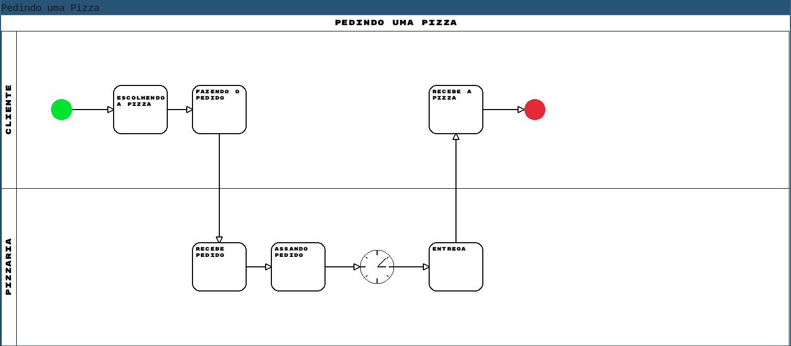
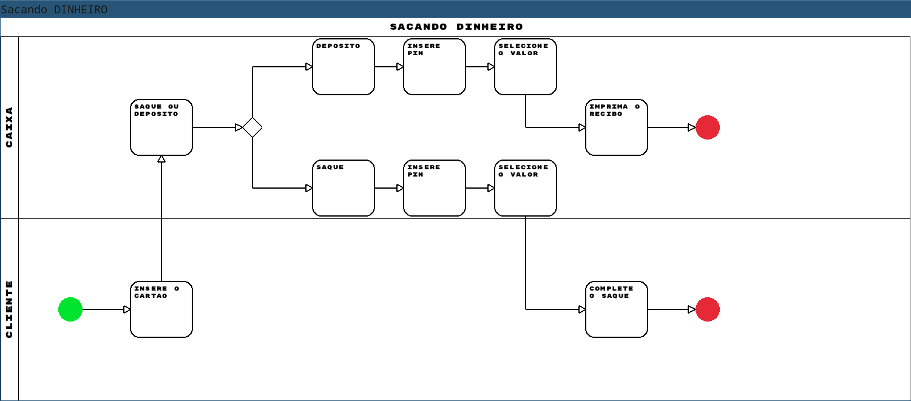
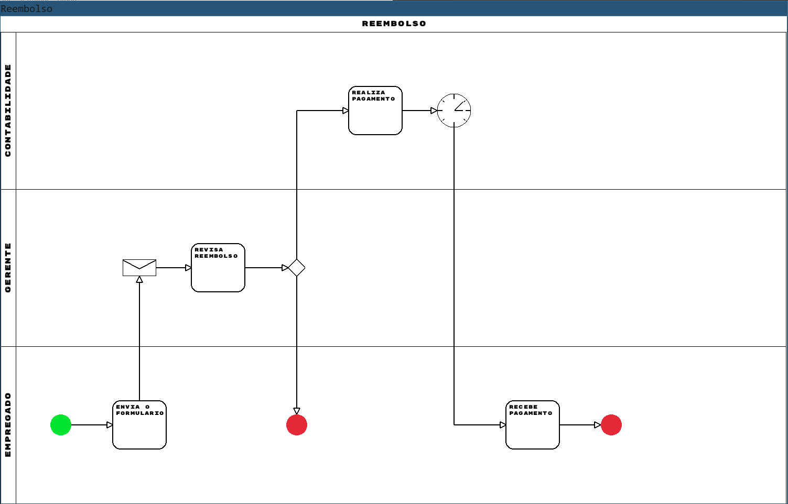

## Relatório Compiladores

O tema escolhido para o trabalho de compiladores foi BPMN (Bussiness Process Model and Notation). Através do uso de uma linguagem de marcação semelhante ao XML/HTML, será possível criar um modelo gráfico. A linguagem escolhida para desenvolvimento foi C e, como biblioteca gráfica, foi utilizado Raylib.

Na linguagem teremos alguns conceitos chaves, sendo eles:
- Processos: O modelo principal que esta sendo descrito. Cada arquivo deverá possuir uma e apenas uma declaração de processo;
- Subprocessos: Um arquivo poderá possuir diversos subprocessos e ele representa etapas do processo principal;
- Eventos: Um subprocesso será descrito através de diferentes eventos.

O seguinte exemplo define um processo para pedir uma pizza:

Exemplo de entrada:

```xml
<process name='Pedindo uma Pizza'>

    <subprocess id='cliente' name='Cliente'>
        <events>
            <starter id='start' points='escolhendo'/>
            <task id='escolhendo' name='Escolhendo a pizza' points='pedindo'/>
            <task id='pedindo' name='Fazendo o pedido' points='pizzaria.recebendo_pedido'/>

            <col num='2'/>
            <task id='recebe_pizza' name='Recebe a Pizza' points='so_comer'/>

            <end id='so_comer' />
        </events>
    </subprocess>

    <subprocess id='pizzaria' name='Pizzaria'>
        <events>
            <col num='2' />
            <task id='recebendo_pedido' name='Recebe Pedido' points='assando' />
            <task id='assando' name='Assando Pedido' points='wait' />
            <wait id='wait' points='delivery' />
            <task id='delivery' name='Entrega' points='cliente.recebe_pizza' />

        </events>
    </subprocess>

</process>
```

Exemplo de saída:



### Analisador léxico

O análisador foi definido para reconher os seguintes tokens:
```
TOKEN_OPTAG := "<"
TOKEN_CLTAG := ">"
TOKEN_ATR := "="
TOKEN_SLASH := /
TOKEN_ID := [a-zA-Z]+[a-zA-Z0-9_]*
TOKEN_STR := '[\w\S]*'
TOKEN_TYPE := "task" | "gateway" | "starter" | "end"
TOKEN_PROCESS := "process"
TOKEN_SUBPROCESS := "subprocess"
TOKEN_EVENTS := "events"
TOKEN_COL := "col"
```

Para o reconhecimento dos tokens, o lexer lê cada caracter da entrada e faz as seguintes verificações:

```
Se está lendo o primeiro caractere do token:
    o caractere é <? Retorna TOKEN_OPTAG
    o caractere é >? Retorna TOKEN_CLTAG
    o caractere é =? Retorna TOKEN_ATR
    o caractere é /? Retorna TOKEN_SLASH
    o caractere é '?
        continue lendo até encontrar o próximo ' e retorna TOKEN_STR
    o caractere é alfanúmerico?
        continue lendo até encontrar um espaço
            o valor lido é "task" ou "gateway" ou "stater" ou "end"? Retorna TOKEN_TYPE
            o valor lido é "process"? Retorna TOKEN_PROCESS
            o valor lido é "subprocess"? REtorna TOKEN_SUBPROCESS
            o valor lido é "events"? Retorna TOKEN_EVENTS
            o valor lido é "colr"? Retorn TOKEN_COL
```

Essa lógica é implementada da seguinte maneira:

```c
Token next_token(Lexer *lexer) {
    char c = lex_trim_left(lexer);
    size_t len = 0;
    lexer->token.value[len++] = c;

    if (c == '\0') {
        lexer->token.kind = TOKEN_EOF;
        return lexer->token;
    }

    switch (c) {
        case '<': lexer->token.kind = TOKEN_OPTAG; break;
        case '>': lexer->token.kind = TOKEN_CLTAG; break;
        case '=': lexer->token.kind = TOKEN_ATR;   break;
        case '/': lexer->token.kind = TOKEN_SLASH; break;

        case '\'': {
            len = 0;
            c = lex_getc(lexer);
            while (len < (MAX_TOKEN_LEN - 1) && c != '\0' && c != '\'' && c != '\n') {
                lexer->token.value[len++] = c;
                c = lex_getc(lexer);
            }

            if (c != '\'') {
                PRINT_ERROR(lexer, "Unexpected end of string literal");
                FAIL;
            }

            lexer->token.kind = TOKEN_STR;
        } break;

        default: {
            if (!isalpha(c)) {
                PRINT_ERROR_FMT(lexer, "Invalid character `%c`", c);
                FAIL;
            }

            char peek = lex_peekc(lexer);
            while (len < (MAX_TOKEN_LEN - 1) && c != '\0' && (isalnum(peek) || peek == '_')) {
                c = lex_getc(lexer);
                lexer->token.value[len++] = c;
                peek = lex_peekc(lexer);
            }

            lexer->token.value[len] = '\0';
            lexer->token.kind = get_kind(lexer->token.value, len);
        }
    }

    lexer->token.value[len] = '\0';
    return lexer->token;
}
```

### Parser

No analisador léxico, além do código que está sendo interpretado e a localização do cursor, algumas outras estrutura são armazeadas por conveniência, como a tabela de simbolos e o último token lido.

```c
typedef struct {
    char *content;
    size_t col, row;
    const char *file_path;
    Hash_Map symbols;
    Token token;
} Lexer;
```

O parsing do código fornecido é feito através do uso de tradução dirigida por sintaxe e análise preditiva. Segue a especificação da grámatica:

```
processo ::= '<process name=' str '>' lista_subprocesso '</process>'

lista_subprocesso ::= subprocesso |
                      subprocesso lista_subprocesso

subprocesso ::= '<subprocess' lista_atribuicao '>' eventos '</subprocess>'

eventos ::= '<events>' lista_evento '</events>'

lista_evento ::= evento |
                 evento lista_evento

evento ::= evento_tipo |
           coluna

evento_tipo ::=  '<starter' lista_atribuicao '/>' |
                 '<task' lista_atribuicao '/>'    |
                 '<gateway' lista_atribuicao '/>' |
                 '<end' lista_atribuicao '/>'

coluna ::= '<col>' lista_evento '</col>' | '<col/>'

lista_atribuicao ::= atribuicao |
                     atribuicao lista_atribuicao

atribuicao ::= id '=' str

id ::= [a-zA-Z]+[a-zA-Z0-9_]*

str ::= "'" .* "'"

```

### Exemplos

#### Sacando Dinheiro

```xml
<process name='Sacando DINHEIRO'>

    <subprocess id='atm' name='Caixa'>
        <events>
            <col />
            <task id='saque_ou_deposito' name='Saque ou Deposito' points='saque_ou_deposito_gateway'/>
            <gateway id='saque_ou_deposito_gateway' points='deposito,saque' />
            <col >
                <task id='deposito' name='Deposito' row='up' points='senha_deposito'/>
                <task id='saque' name='Saque' row='down' points='senha_saque'/>
            </col>
            <col >
                <task id='senha_deposito' name='Insere PIN' row='up' points='valor_deposito'/>
                <task id='senha_saque' name='Insere PIN' row='down'  points='valor_saque'/>
            </col>
            <col >
                <task id='valor_deposito' name='Selecione o valor' row='up' points='recibo_deposito'/>
                <task id='valor_saque' name='Selecione o valor' row='down' points='cliente.complete_saque'/>
            </col>

            <task id='recibo_deposito' name='Imprima o recibo' points='end_deposito'/>
            <end id='end_deposito'/>

        </events>
    </subprocess>


    <subprocess id='cliente' name='Cliente'>
        <events>
            <starter id='start' points='inserir_cartao' />
            <task id='inserir_cartao' name='Insere o cartao' points='atm.saque_ou_deposito'/>
            <col num='4' />
            <task id='complete_saque' name='Complete o saque' points='end_saque'/>
            <end id='end_saque' />
        </events>
    </subprocess>

</process>
```




#### Reembolso

```xml
<process name='Reembolso'>

    <subprocess id='contabilidade' name='Contabilidade'>
        <events>
            <col num='4'/>
            <task id='realiza_pagamento' name='Realiza Pagamento' points='espera_pagamento'/>
            <wait id='espera_pagamento' points='empregado.recebe_pagamento' />
        </events>
    </subprocess>


    <subprocess id='gerente' name='Gerente'>
        <events>
            <col />
            <mail id='recebe_formulario' points='revisa_reembolso'/>
            <task id='revisa_reembolso' name='Revisa reembolso' points='revisao_gateway' />
            <gateway id='revisao_gateway' points='empregado.recusado,contabilidade.realiza_pagamento' />
        </events>
    </subprocess>

    <subprocess id='empregado' name='Empregado'>
        <events>
            <starter id='start' points='envia_formulario'/>
            <task id='envia_formulario' name='Envia o Formulario' points='gerente.recebe_formulario'/>
            <col />
            <end id='recusado' />
            <col />
            <col />
            <task name='Recebe Pagamento' id='recebe_pagamento' points='aceito'/>
            <end id='aceito' />
        </events>
    </subprocess>

</process>
```

